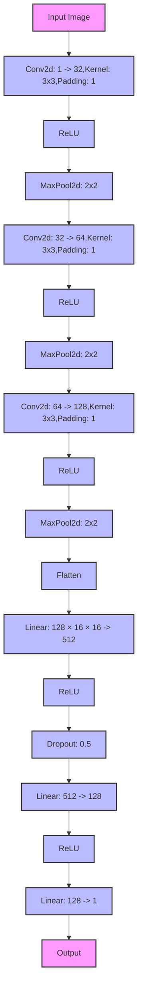

```mermaid
graph TD;
    A[Input Image] --> B[Conv2d: 1 -> 32,Kernel: 3x3,Padding: 1];
    B --> C[ReLU];
    C --> D[MaxPool2d: 2x2];
    D --> E[Conv2d: 32 -> 64,Kernel: 3x3,Padding: 1];
    E --> F[ReLU];
    F --> G[MaxPool2d: 2x2];
    G --> H[Conv2d: 64 -> 128,Kernel: 3x3,Padding: 1];
    H --> I[ReLU];
    I --> J[MaxPool2d: 2x2];
    J --> K[Flatten];
    K --> L[Linear: 128 × 16 × 16 -> 512];
    L --> M[ReLU];
    M --> N[Dropout: 0.5];
    N --> O[Linear: 512 -> 128];
    O --> P[ReLU];
    P --> Q[Linear: 128 -> 1];
    Q --> R[Output];

    style A fill:#f9f,stroke:#333,stroke-width:2px;
    style B fill:#bbf,stroke:#333,stroke-width:2px;
    style C fill:#bbf,stroke:#333,stroke-width:2px;
    style D fill:#bbf,stroke:#333,stroke-width:2px;
    style E fill:#bbf,stroke:#333,stroke-width:2px;
    style F fill:#bbf,stroke:#333,stroke-width:2px;
    style G fill:#bbf,stroke:#333,stroke-width:2px;
    style H fill:#bbf,stroke:#333,stroke-width:2px;
    style I fill:#bbf,stroke:#333,stroke-width:2px;
    style J fill:#bbf,stroke:#333,stroke-width:2px;
    style K fill:#bbf,stroke:#333,stroke-width:2px;
    style L fill:#bbf,stroke:#333,stroke-width:2px;
    style M fill:#bbf,stroke:#333,stroke-width:2px;
    style N fill:#bbf,stroke:#333,stroke-width:2px;
    style O fill:#bbf,stroke:#333,stroke-width:2px;
    style P fill:#bbf,stroke:#333,stroke-width:2px;
    style Q fill:#bbf,stroke:#333,stroke-width:2px;
    style R fill:#f9f,stroke:#333,stroke-width:2px;


```