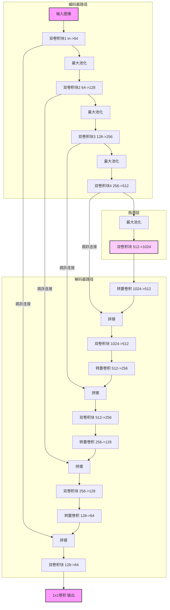

# U-Net 网络结构

```mermaid
graph TD
    subgraph "编码器路径"
        Input[输入图像] --> Conv1[双卷积块1 in->64]
        Conv1 --> Pool1[最大池化]
        Pool1 --> Conv2[双卷积块2 64->128]
        Conv2 --> Pool2[最大池化]
        Pool2 --> Conv3[双卷积块3 128->256]
        Conv3 --> Pool3[最大池化]
        Pool3 --> Conv4[双卷积块4 256->512]
    end

    subgraph "瓶颈层"
        Conv4 --> Pool4[最大池化]
        Pool4 --> Bottleneck[双卷积块 512->1024]
    end

    subgraph "解码器路径"
        Bottleneck --> Upconv1[转置卷积 1024->512]
        Conv4 --跳跃连接--> Concat1[拼接]
        Upconv1 --> Concat1
        Concat1 --> Dconv1[双卷积块 1024->512]

        Dconv1 --> Upconv2[转置卷积 512->256]
        Conv3 --跳跃连接--> Concat2[拼接]
        Upconv2 --> Concat2
        Concat2 --> Dconv2[双卷积块 512->256]

        Dconv2 --> Upconv3[转置卷积 256->128]
        Conv2 --跳跃连接--> Concat3[拼接]
        Upconv3 --> Concat3
        Concat3 --> Dconv3[双卷积块 256->128]

        Dconv3 --> Upconv4[转置卷积 128->64]
        Conv1 --跳跃连接--> Concat4[拼接]
        Upconv4 --> Concat4
        Concat4 --> Dconv4[双卷积块 128->64]
    end

    Dconv4 --> Output[1x1卷积 输出]

    style Input fill:#f9f,stroke:#333,stroke-width:2px
    style Output fill:#f9f,stroke:#333,stroke-width:2px
    style Bottleneck fill:#fcf,stroke:#333,stroke-width:2px
```
