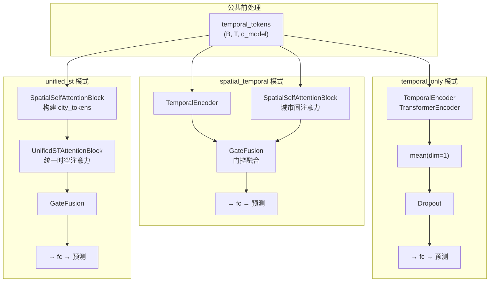
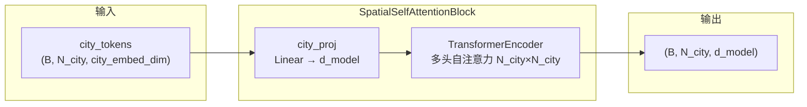
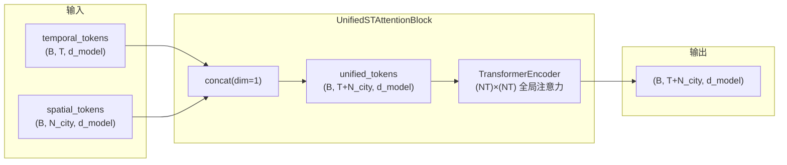
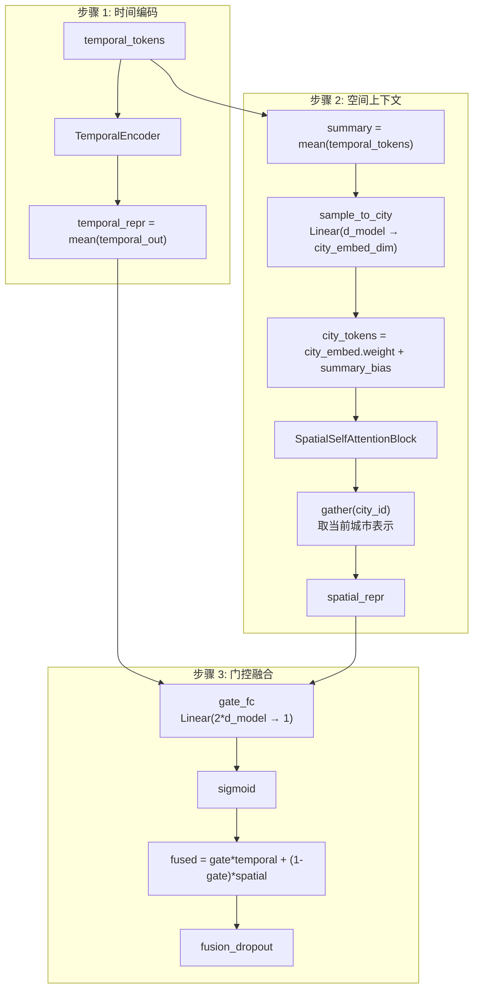
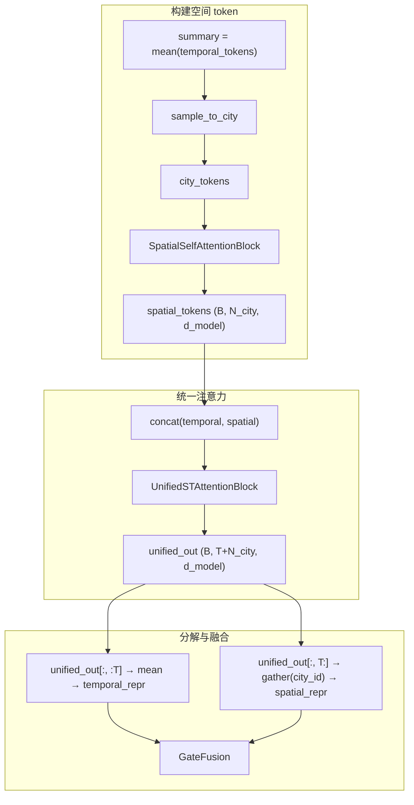

# ST-Transformer 模型结构示意图

基于 `ST-Transformer.py` 的完整架构说明。

---

## 一、整体数据流

```mermaid
flowchart TB
    subgraph Input [输入层]
        X["x: (B, T, F)"]
        CityID["city_id: (B,)"]
    end

    subgraph Embed [嵌入与投影]
        InputProj["input_proj\nLinear(F → d_model)"]
        PosEnc["pos_enc\nSinusoidalPositionalEncoding"]
        CityEmbed["city_embed\nEmbedding(N_city → city_embed_dim)"]
        EmbedProj["embed_proj\nLinear(d_model+city_embed_dim → d_model)"]
    end

    subgraph ModeSwitch {attention_mode}
        TemporalOnly["temporal_only"]
        SpatialTemporal["spatial_temporal"]
        UnifiedST["unified_st"]
    end

    subgraph Output [输出层]
        FC["fc\nLinear(d_model → 1)"]
        Pred["PM2.5 预测 (B,)"]
    end

    X --> InputProj
    InputProj --> PosEnc
    PosEnc --> EmbedProj
    CityID --> CityEmbed
    CityEmbed --> EmbedProj
    EmbedProj --> ModeSwitch
    ModeSwitch --> FC
    FC --> Pred
```

---

## 二、三种注意力模式分支



---

## 三、空间自注意力块 (SpatialSelfAttentionBlock)



**说明**：在同一 batch 内，对所有城市 token 做自注意力，捕捉城市间的空间依赖。

---

## 四、统一时空注意力块 (UnifiedSTAttentionBlock)



**说明**：将时间 token 与空间 token 拼接为统一序列，做全局自注意力，建模任意时空点之间的依赖。

---

## 五、spatial_temporal 模式详细流程



---

## 六、unified_st 模式详细流程



---

## 七、模块与张量形状对照表

| 模块 | 输入形状 | 输出形状 |
|------|----------|----------|
| input_proj | (B, T, F) | (B, T, d_model) |
| pos_enc | (B, T, d_model) | (B, T, d_model) |
| city_embed | city_id (B,) | (B, T, city_embed_dim) 广播 |
| embed_proj | (B, T, d_model+city_embed_dim) | (B, T, d_model) |
| TemporalEncoder | (B, T, d_model) | (B, T, d_model) |
| SpatialSelfAttentionBlock | (B, N_city, city_embed_dim) | (B, N_city, d_model) |
| UnifiedSTAttentionBlock | temporal(B,T,d) + spatial(B,N,d) | (B, T+N_city, d_model) |
| GateFusion | temporal_repr(B,d) + spatial_repr(B,d) | (B, d_model) |
| fc | (B, d_model) | (B, 1) → squeeze → (B,) |

---

## 八、CLI 参数与模式对应

| 参数 | 默认值 | 说明 |
|------|--------|------|
| --attention-mode | temporal_only | temporal_only / spatial_temporal / unified_st |
| --spatial-heads | 4 | 空间注意力头数 |
| --spatial-layers | 1 | 空间 Transformer 层数 |
| --unified-heads | 4 | 统一时空注意力头数 |
| --unified-layers | 1 | 统一时空 Transformer 层数 |
| --fusion-dropout | 0.1 | 融合后 Dropout |
