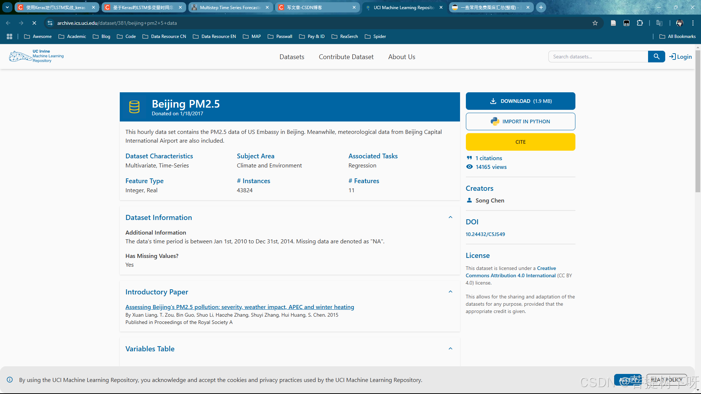
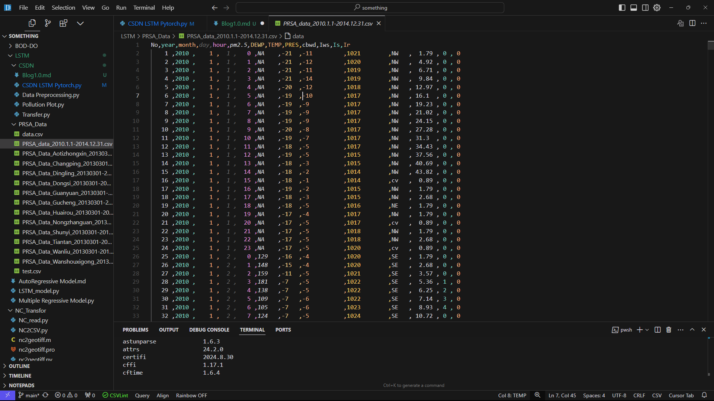
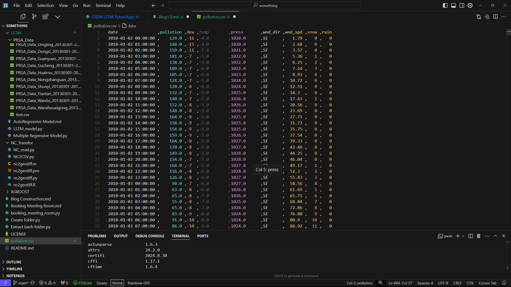
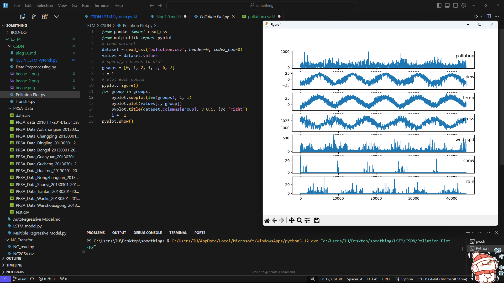

# 基于Pytorch的LSTM多变量时间序列预测（北京PM2.5数据集）

## 前言

### 参考列表：

[使用Keras进行LSTM实战_keras lstm-CSDN博客](https://blog.csdn.net/u012735708/article/details/82769711?spm=1001.2014.3001.5506)

[基于Keras的LSTM多变量时间序列预测（北京PM2.5数据集pollution.csv）-CSDN博客](https://blog.csdn.net/Together_CZ/article/details/84892130?spm=1001.2014.3001.5506)

[Multistep Time Series Forecasting with LSTMs in Python](https://machinelearningmastery.com/multi-step-time-series-forecasting-long-short-term-memory-networks-python/)

### 数据来源：

点击超链接：[北京PM2.5数据集](https://archive.ics.uci.edu/dataset/381/beijing+pm2+5+data)正常网络可以直接免费下载


### 各种配置：

OS：Windows 11 24H2

IDE：Cursor 0.43.6

Python version：3.12.8 64bit

Pytorch version：2.5.1

Numpy version：1.26.4

Pandas version：2.2.2

Sklearn version：1.5.2

matplotlib version：3.9.3

写作日期：2024年12月11日 北京时间1：00 AM 

### 写作缘由

&emsp;&emsp;当我找到这三篇参考文章的时候很开心，因为我知道，我肯定可以学会文章当中的方法。但是我错了，因为Keras已经并入Tensorflow，我需要重构整个代码，即便我使用单独的Keras库，也需要修改大量的代码。
&emsp;&emsp;在下载TensorFlow的过程中，我遇到的第一个问题就是Python的版本不匹配，我现有的版本实在太高了，需要降级到Python3.9.那我肯定是不乐意，所以我打开Cursor，选择使用Pytorch框架开始实现这些功能。
&emsp;&emsp;重构的过程是痛苦，我需要先看懂三位前辈是怎么操作，然后理解代码的含义，我不得不阅读大量文档，甚至有的语法早就随着版本更迭，彻底失效了。由于我的编程功底也不是特别扎实，经常运行报错。
&emsp;&emsp;经过4天的不懈努力，我将这两篇2018年的文章，复现成了Pytorch框架，并且添加了大量的注释，方便大家理解。马上2025年了，我希望弥补这份代码六年来的发展鸿沟，那我就抛砖引玉，开始献丑了。

## 数据集介绍
点击上文链接，下载压缩包到桌面就行了，文件超级小，不占空间；解压后，打开文件，可以看到如下数据：

`
1.No 行数
`
`
2.year 年
`
`
3.month 月
`
`
4.day 日
`
`
5.hour 小时
`
`
6.pm2.5 PM2.5浓度
`
`
7.DEWP 露点
`
`
8.TEMP 温度
`
`
9.PRES 大气压
`
`
10.cbwd 风向
`
`
11.lws 风速
`
`
12.ls 累积雪量
`
`
13.lr 累积雨量
`

## 数据预处理


&emsp;&emsp;第一步是将日期时间信息整合为一个日期时间，以便我们可以将其用作Pandas的索引；然后将第一列的No.列删除，因为这列是行数，对模型训练没有帮助；然后是寻找数据集当中的空值（NA），并将所在的列删除。注意，这里是删除，而不是填充，**这是我和参考文章的重大区别。**
&emsp;&emsp;当然有的朋友喜欢手动操作CSV文件，那也可以，但是需要手动删除No.列，我算你厉害。我会在文章最后将**资源和代码**打包，方便大家下载。

```
from pandas import read_csv
import pandas as pd
import numpy as np

# 首先读取数据，不进行日期解析
dataset = read_csv(r'C:\Users\IU\Desktop\something\Long-short term memory\PRSA_Data\PRSA_data_2010.1.1-2014.12.31.csv')

# 读取数据后立即打印列名
print("数据集的列名:", dataset.columns.tolist())

# 合并年月日时为日期时间列
dataset['date'] = pd.to_datetime(dataset[['year', 'month', 'day', 'hour']].astype(str).agg('-'.join, axis=1), 
                                format='%Y-%m-%d-%H')

# 设置日期列为索引
dataset.set_index('date', inplace=True)

# 删除不需要的列
dataset.drop(['No', 'year', 'month', 'day', 'hour'], axis=1, inplace=True)

# 设置列名
dataset.columns = ['pollution', 'dew', 'temp', 'press', 'wnd_dir', 'wnd_spd', 'snow', 'rain']

# 检查缺失值的情况
print("缺失值统计：")
print(dataset.isna().sum())

# 检查是否存在字符串形式的'NA'
print("\n'NA'字符串的数量：")
print((dataset == 'NA').sum())

# 更全面的缺失值处理
dataset['pollution'] = dataset['pollution'].replace('NA', np.nan)  # 将字符串'NA'转换为np.nan
dataset['pollution'] = pd.to_numeric(dataset['pollution'], errors='coerce')  # 确保数据类型为数值型
dataset['pollution'].fillna(0, inplace=True)  # 填充缺失值

# 再次检查缺失值情况
print("\n处理后的缺失值统计：")
print(dataset.isna().sum())

# 删除前24小时的数据
dataset = dataset[24:]

# 查看前5行数据
print(dataset.head(5))

# 保存到文件
dataset.to_csv('pollution.csv')
```

我们将处理好的数据保存为"pollution.csv".


现在的数据格式已经更加适合处理，可以简单的对每列进行绘图。下面的代码加载了“pollution.csv”文件，并对除了类别型特性“风速”的每一列数据分别绘图。

```
from pandas import read_csv
from matplotlib import pyplot
# load dataset
dataset = read_csv('pollution.csv', header=0, index_col=0)
values = dataset.values
# specify columns to plot
groups = [0, 1, 2, 3, 5, 6, 7]
i = 1
# plot each column
pyplot.figure()
for group in groups:
    pyplot.subplot(len(groups), 1, i)
    pyplot.plot(values[:, group])
    pyplot.title(dataset.columns[group], y=0.5, loc='right')
    i += 1
pyplot.show()
```

运行上述代码，并对7个变量在5年的范围内绘图。




## 多变量LSTM预测模型

### LSTM数据准备

&emsp;&emsp;第一步是为LSTM准备污染数据集。这涉及将数据集视为监督学习问题并对输入变量进行归一化处理。考虑到上一个时间段的污染测量和天气条件，我们将把监督学习问题作为预测当前时刻（t）的污染情况。根据过去24小时的天气情况和污染，预测下一个小时的污染，并给予下一个小时的“预期”天气条件。

&emsp;&emsp;下面代码中首先加载“pollution.csv”文件，并利用sklearn的预处理模块对类别特征“风向”进行编码，当然也可以对该特征进行one-hot编码。 接着对所有的特征进行归一化处理，然后将数据集转化为有监督学习问题，同时将需要预测的当前时刻（t）的天气条件特征移除，完整代码如下：

```
# 加载数据集
dataset = read_csv('pollution.csv', header=0, index_col=0)  # 读取CSV文件,第一行为列名,第一列为索引
values = dataset.values  # 将DataFrame转换为numpy数组

# 首先确保所有字符串数据被清理
for i in range(values.shape[1]):
    if isinstance(values[0,i], str):
        values[:,i] = [x.strip() if isinstance(x, str) else x for x in values[:,i]]

# 然后对风向列进行编码
encoder = LabelEncoder()
values[:,4] = encoder.fit_transform(values[:,4].astype(str))

# 最后转换为float32
values = values.astype('float32')

# normalize features
scaler = MinMaxScaler(feature_range=(0, 1))
scaled = scaler.fit_transform(values)
# frame as supervised learning
reframed = series_to_supervised(scaled, 1, 1)
# drop columns we don't want to predict
reframed.drop(reframed.columns[[9,10,11,12,13,14,15]], axis=1, inplace=True)
print(reframed.head())
# split into train and test sets
values = reframed.values
n_train_hours = 365 * 24
train = values[:n_train_hours, :]
test = values[n_train_hours:, :]
# split into input and outputs
train_X, train_y = train[:, :-1], train[:, -1]
test_X, test_y = test[:, :-1], test[:, -1]
# reshape input to be 3D [samples, timesteps, features]
train_X = train_X.reshape((train_X.shape[0], 1, train_X.shape[1]))
test_X = test_X.reshape((test_X.shape[0], 1, test_X.shape[1]))
print(train_X.shape, train_y.shape, test_X.shape, test_y.shape)
```

运行上述代码，能看到被转化后的数据集，数据集包括8个输入变量（输入特征）和1个输出变量（当前时刻t的空气污染值，标签） 
　　数据集的处理比较简单，还有很多的方式可以尝试，一些可以尝试的方向包括： 
　　1. 对“风向”特征哑编码； 
　　2. 加入季节特征； 
　　3. 时间步长超过1。 
　　其中，上述第三种方式对于处理时间序列问题的LSTM可能是最重要的。

### 构建模型

在这一节，我们将构造LSTM模型。 
　　首先，我们需要将处理后的数据集转化为张量（Tensor），然后设置设备（CPU或GPU），最后定义模型参数和损失函数（MAE）、优化器（Adam）。LSTM模型中，隐藏层有50个神经元，输出层1个神经元（回归问题），输入变量是一个时间步（t-1）的特征。

```
# 将数据转换为PyTorch张量
train_X = torch.FloatTensor(train_X)
train_y = torch.FloatTensor(train_y)
test_X = torch.FloatTensor(test_X)
test_y = torch.FloatTensor(test_y)

# 设置设备
device = torch.device('cuda' if torch.cuda.is_available() else 'cpu')

# 定义模型参数
input_dim = train_X.shape[2]  # 特征数量
hidden_dim = 50  # LSTM隐藏层维度
model = LSTMModel(input_dim, hidden_dim)
model = model.to(device)

# 定义损失函数和优化器
criterion = nn.L1Loss()  # MAE损失
optimizer = torch.optim.Adam(model.parameters())
```


此处我们训练100次，每批72个，同时打印损失值，训练完之后评估
以下来是模型训练部分的代码：

```
# 训练模型
train_losses = []  # 训练集损失
val_losses = []  # 测试集损失
epochs = 100   # 训练次数
batch_size = 72  # 批次大小

for epoch in range(epochs):
    model.train()
    # 批次训练
    for i in range(0, len(train_X), batch_size):
        batch_X = train_X[i:i+batch_size].to(device)
        batch_y = train_y[i:i+batch_size].to(device)
        
        optimizer.zero_grad()
        outputs = model(batch_X)
        loss = criterion(outputs.squeeze(), batch_y)
        loss.backward()
        optimizer.step()
    
    # 评估
    model.eval()
    with torch.no_grad():
        # 训练集损失
        train_outputs = model(train_X.to(device))
        train_loss = criterion(train_outputs.squeeze(), train_y.to(device))
        train_losses.append(train_loss.item())
        
        # 测试集损失
        test_outputs = model(test_X.to(device))
        val_loss = criterion(test_outputs.squeeze(), test_y.to(device))
        val_losses.append(val_loss.item())
    
    if epoch % 10 == 0:
        print(f'Epoch {epoch}: train_loss={train_loss.item():.4f}, val_loss={val_loss.item():.4f}')

```

最后是数据可视化部分：

```
# 绘制损失曲线
pyplot.plot(train_losses, label='train')
pyplot.plot(val_losses, label='test')
pyplot.legend()
pyplot.show()

# 预测
model.eval()
with torch.no_grad():
    yhat = model(test_X.to(device)).cpu().numpy()

# 重塑数据
test_X = test_X.reshape(test_X.shape[0], test_X.shape[2]).numpy()

# invert scaling for forecast
inv_yhat = concatenate((yhat, test_X[:, 1:]), axis=1)
inv_yhat = scaler.inverse_transform(inv_yhat)
inv_yhat = inv_yhat[:,0]

# invert scaling for actual
test_y = test_y.numpy().reshape((len(test_y), 1))
inv_y = concatenate((test_y, test_X[:, 1:]), axis=1)
inv_y = scaler.inverse_transform(inv_y)
inv_y = inv_y[:,0]

# calculate RMSE
rmse = sqrt(mean_squared_error(inv_y, inv_yhat))
print('Test RMSE: %.3f' % rmse)
```

