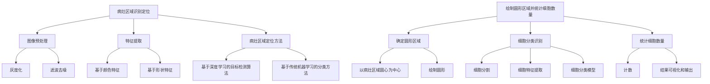

```mermaid
graph TD
    A[病灶区域识别定位] --> B[图像预处理]
    A --> C[特征提取]
    A --> D[病灶区域定位方法]
    B --> E[灰度化]
    B --> F[滤波去噪]
    C --> G[基于颜色特征]
    C --> H[基于形状特征]
    D --> I[基于深度学习的目标检测算法]
    D --> J[基于传统机器学习的分类方法]
    
    K[绘制圆形区域并统计细胞数量] --> L[确定圆形区域]
    K --> M[细胞分类识别]
    K --> N[统计细胞数量]
    L --> O[以病灶区域圆心为中心]
    L --> P[绘制圆形]
    M --> Q[细胞分割]
    M --> R[细胞特征提取]
    M --> S[细胞分类模型]
    N --> T[计数]
    N --> U[结果可视化和输出]
```

```mermaid
graph TD
    %% 病灶区域识别定位部分
    A[病灶区域识别定位] --> B[图像预处理]
    B --> B1[灰度化]
    B --> B2[滤波去噪]
    A --> C[特征提取]
    C --> C1[基于颜色特征]
    C --> C2[基于形状特征]
    A --> D[病灶区域定位方法]
    D --> D1[基于深度学习的目标检测算法]
    D --> D2[基于传统机器学习的分类方法]

    %% 绘制圆形区域并统计细胞数量部分
    E[绘制圆形区域并统计细胞数量] --> F[确定圆形区域]
    F --> F1[以病灶区域圆心为中心]
    F --> F2[绘制圆形]
    E --> G[细胞分类识别]
    G --> G1[细胞分割]
    G --> G2[细胞特征提取]
    G --> G3[细胞分类模型]
    E --> H[统计细胞数量]
    H --> H1[计数]
    H --> H2[结果可视化和输出]
```